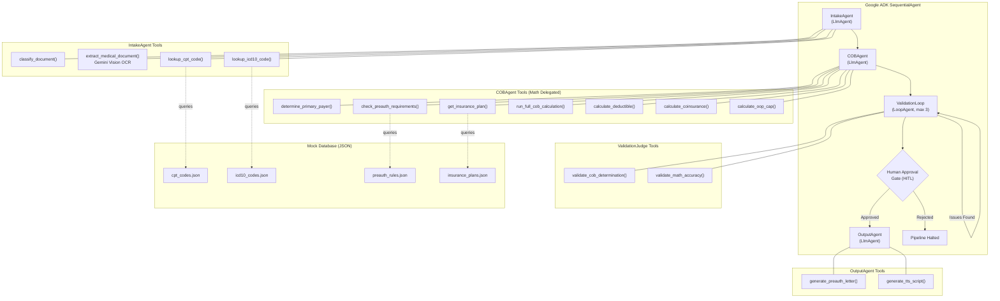
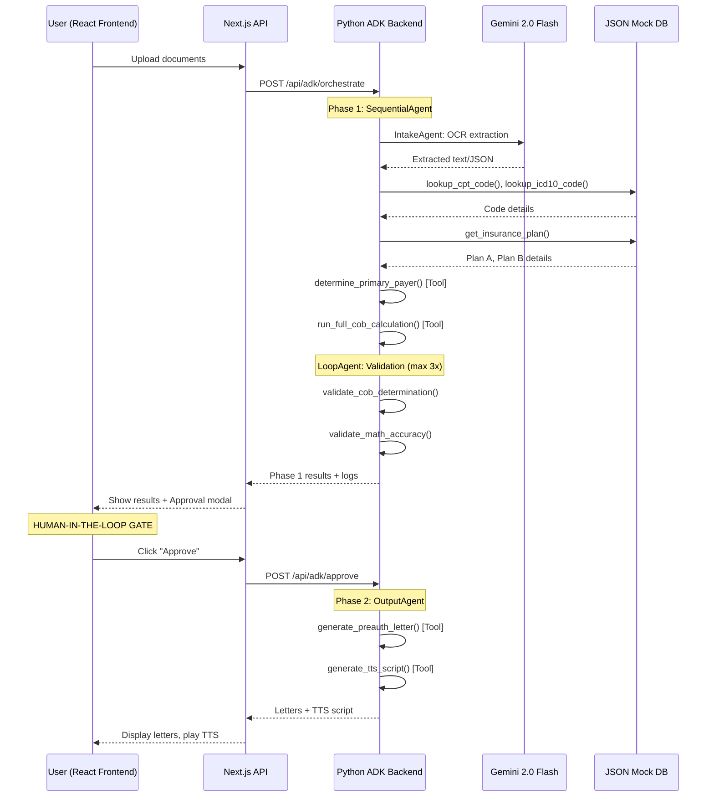

# DuCO-Agent Architecture — Google ADK Orchestration

## System Overview

DuCO-Agent uses **Google ADK (Agent Development Kit)** with a **SequentialAgent** orchestration pattern enhanced by a **LoopAgent** for LLM-as-judge validation and **Human-in-the-Loop (HITL)** approval gate.

## Orchestration Pattern

## Data Flow

## Key Design Principles

| Principle | Implementation |
|---|---|
| **Math → Tools** | Agents NEVER compute. They call `calculate_deductible()`, `calculate_coinsurance()`, `calculate_oop_cap()` with raw numbers |
| **Codes → Database** | All CPT/ICD-10 lookups go through `lookup_cpt_code()` / `lookup_icd10_code()` which query JSON files |
| **Validation → Loop** | `LoopAgent` runs `ValidationJudge` up to 3 times. Uses both rule-based and LLM-as-judge validation |
| **Approval → HITL** | Pipeline pauses after validation. Human must explicitly approve before output generation |
| **Logs → Streaming** | SSE endpoint streams agent traces in real-time to the frontend |
| **OCR → Gemini** | `extract_medical_document()` uses Gemini 2.0 Flash Vision API |

## ADK Pattern Reference

Based on [Google ADK Documentation](https://google.github.io/adk-docs/agents/):

- **SequentialAgent**: Runs sub-agents in order. Used as the root orchestrator.
- **LlmAgent**: Each specialized agent (Intake, COB, Validation, Output) with specific tools.
- **LoopAgent**: Wraps ValidationJudge for iterative quality checks.
- **FunctionTool**: All math, database, OCR, and output operations are tools.
